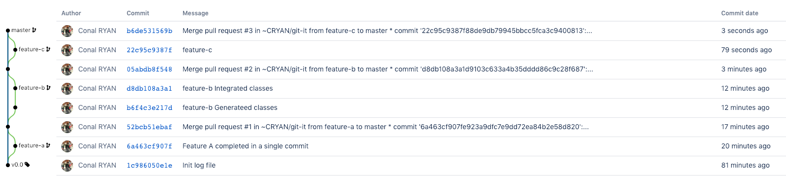
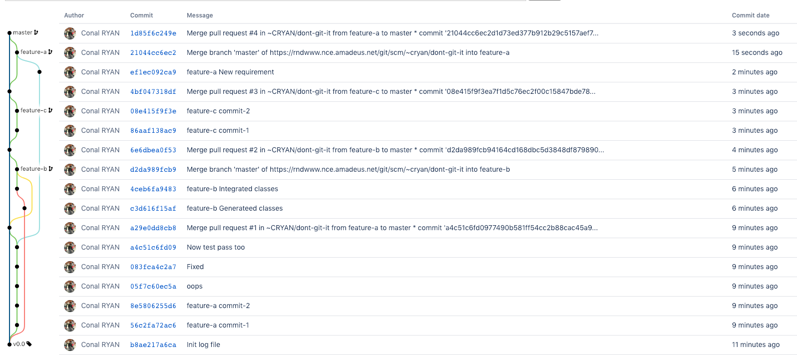
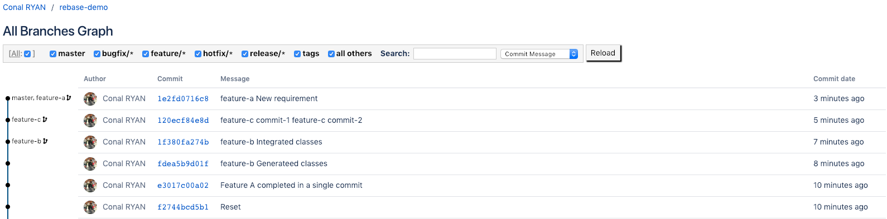
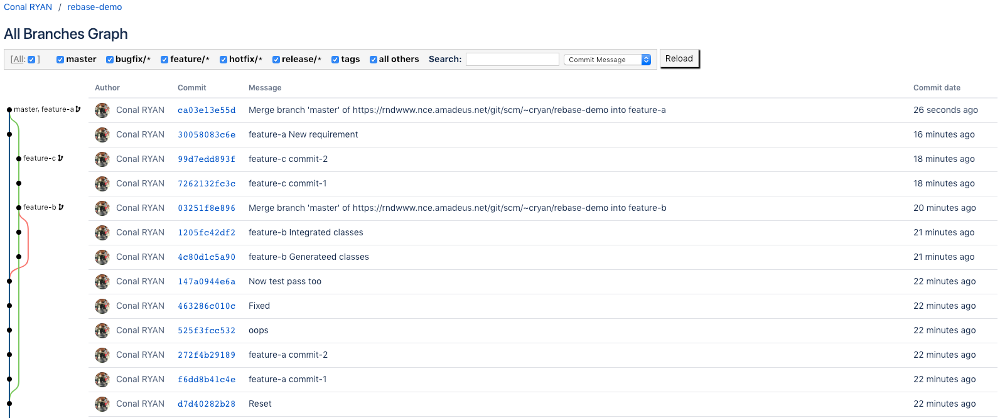
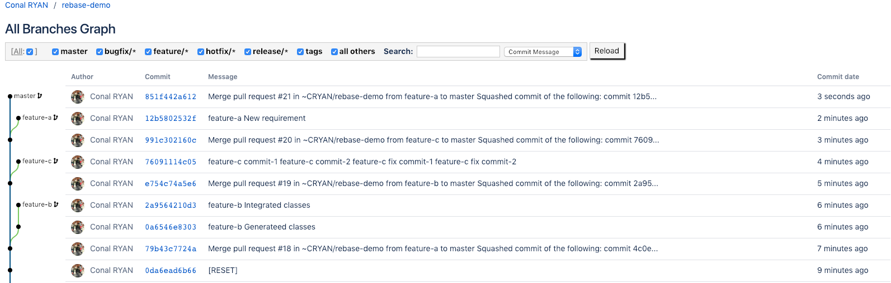

# Rebase Demo

# don't git it


## Feature A
1. Run
```bash
bash ./scripts/1-feature-a.sh
```
2. Create Pull Request feature-a > master
3. Merge Pull Request feature-a > master


## Feature B
1. Run
```bash
bash ./scripts/2-feature-b.sh
```
2. Create Pull Request feature-b > master
3. Merge Pull Request feature-b > master
4. Fix merge conflict
```bash
# on feature-b branch
git pull origin master
```
```
Init
<<<<<<< HEAD
feature-b commit-1
feature-b commit-2
=======
feature-a commit-1
feature-a commit-2
Oopps
Fixed
Now tests pass too
>>>>>>> f872178d23e17221d915c06d1d31d907e04bb5f4
```
```bash
# fix conflict
git add .
git commit
git push
```


## Feature C
1. Run
```bash
bash ./scripts/3-feature-c.sh
```
2. Create Pull Request feature-c > master
3. Merge Pull Request feature-c > master


## Feature A Update
1. Run
```bash
bash ./scripts/4-feature-a-update.sh
```
2. Create Pull Request feature-a > master
3. Fix merge conflict
```bash
# on feature-a branch
git pull origin master
```
```
Init
feature-b Generated classes
feature-b Integrated classes
feature-a commit-1
feature-a commit-2
Oopps
Fixed
Now tests pass too
<<<<<<< HEAD
feature-a New requirement
=======
feature-c commit-1
feature-c commit-2
feature-c fix commit-1
feature-c fix commit-2
>>>>>>> 7e95b3a734c4d4f5062cbce3908c6edcf9408f8d
```
```bash
# fix conflict
git add .
git commit
git push
```

4. Merge Pull Request feature-a > master


# git it

## Let's try rebasing!
1. Run
```bash
bash ./scripts/reset.sh
```


## Feature A
1. Run
```bash
bash ./scripts/1-feature-a.sh
```
2. Create Pull Request feature-a > master
3. Cleanup the commits to a few essential commits
```bash
git rebase -i HEAD~5
```
4. Follow prompts
```bash
reword 3f84c06 feature-a commit-1
fixup 4b4dc48 feature-a commit-2
f 9f5feba oops
f b00c695 Fixed
f 0e3f566 Now test pass too

# Rebase c468c05..0e3f566 onto c468c05 (5 commands)
#
# Commands:
# p, pick = use commit
# r, reword = use commit, but edit the commit message
# e, edit = use commit, but stop for amending
# s, squash = use commit, but meld into previous commit
# f, fixup = like "squash", but discard this commit's log message
# x, exec = run command (the rest of the line) using shell
# d, drop = remove commit
#
# These lines can be re-ordered; they are executed from top to bottom.
#
# If you remove a line here THAT COMMIT WILL BE LOST.
#
# However, if you remove everything, the rebase will be aborted.
#
# Note that empty commits are commented out
```

5. Force push to remote branch (should/must be a fork)
```bash
git push --force
```

6. Merge Pull Request feature-a > master


## Feature B
1. Run
```bash
bash ./scripts/2-feature-b.sh
```
2. Create Pull Request feature-b > master
3. Fix merge conflict
```bash
git rebase origin/master

# If origin/master doesn't pull latest use:
git checkout master
git pull
git checkout feature-b
git rebase master
```
```
Init
<<<<<<< HEAD
feature-a commit-1
feature-a commit-2
Oopps
Fixed
Now tests pass too
=======
feature-b commit-1
feature-b commit-2
>>>>>>> f872178d23e17221d915c06d1d31d907e04bb5f4
```

```bash
# fix conflict
git add .
git rebase --continue
# Force push to remote branch (should/must be a fork)
git push --force
```

4. Merge pull request feature-b -> master


## Feature C
1. Run
```bash
bash ./scripts/3-feature-c.sh
```
2. Create Pull Request feature-c > master
3. Cleanup the commits to a few essential commits
```bash
git rebase -i HEAD~4
```
4. Follow promps
```bash
pick 434e52b feature-c commit-1
squash 6ced1e3 feature-c commit-2
s 539dbb4 feature-c fix commit-1
s b639c56 feature-c fix commit-2

# Rebase 5dc761b..b639c56 onto 5dc761b (4 commands)
#
# Commands:
# p, pick = use commit
# r, reword = use commit, but edit the commit message
# e, edit = use commit, but stop for amending
# s, squash = use commit, but meld into previous commit
# f, fixup = like "squash", but discard this commit's log message
# x, exec = run command (the rest of the line) using shell
# d, drop = remove commit
#
# These lines can be re-ordered; they are executed from top to bottom.
#
# If you remove a line here THAT COMMIT WILL BE LOST.
#
# However, if you remove everything, the rebase will be aborted.
#
# Note that empty commits are commented out
```
5. Force push to remote branch (should/must be a fork)
```bash
git push --force
```
6. Merge Pull Request feature-c > master



## Feature A Update
1. Run
```bash
bash ./scripts/4-feature-a-update.sh
```
2. Create Pull Request feature-a > master
3. Fix merge conflict
```bash
git rebase origin/master

# If origin/master doesn't pull latest use:
git checkout master
git pull
git checkout feature-a
git rebase master
```
```
Init
feature-a commit-1
feature-a commit-2
Oopps
Fixed
Now tests pass too
<<<<<<< master
feature-b Generated classes
feature-b Integrated classes
feature-c commit-1
feature-c commit-2
=======
feature-a New requirement
>>>>>>> feature-a
```
```bash
# fix conflict
git add .
git rebase --continue
# Force push to remote branch (should/must be a fork)
git push --force
```
4. Merge Pull Request feature-a > master


# Experiment
1. Run
```bash
bash ./scripts/reset.sh
```
2. Run through the steps above trying different techniques, if you get stuck, start again ```bash ./srcipts/reset.sh```. Keep in mind the reset.sh only resets branches created in the steps above. If you create additional branches/merges, they will not be cleanup up. If you get really stuck, delete your fork and re-fork it.

# Merge Strategies

## Merge commit --no-ff (default)
- Always create a new merge commit and update the target branch to it, even if the source branch is already up to date with the target branch.
- dont-git-it

- git-it


## Fast-forward --ff
- If the source branch is out of date with the target branch, create a merge commit. Otherwise, update the target branch to the latest commit on the source branch.
- dont-git-it

- git-it


## Fast-forward only --ff-only
- If the source branch is out of date with the target branch, reject the merge request. Otherwise, update the target branch to the latest commit on the source branch.
- dont-git-it

- git-it


## Rebase and merge rebase + merge --no-ff
- Rebase commits from the source branch onto the target branch, creating a new non-merge commit for each incoming commit, and create a merge commit to update the target branch.
- dont-git-it

- git-it


## Rebase and fast-forward rebase + merge --ff-only
- Rebase commits from the source branch onto the target branch, creating a new non-merge commit for each incoming commit, and fast-forward the target branch with the resulting commits.
- dont-git-it

- git-it


## Squash --squash
- Combine all commits into one new non-merge commit on the target branch.
- dont-git-it

- git-it


## Squash, fast-forward only --squash --ff-only
- If the source branch is out of date with the target branch, reject the merge request. Otherwise, combine all commits into one new non-merge commit on the target branch.
- dont-git-it

- git-it


# Better Information
All the information above was an adaptation of the sources below. However, these sources go deeper into git internals which is quite interesting!
- Advanced Git https://www.youtube.com/watch?v=0SJCYPsef54
- Git Masterclass https://www.youtube.com/watch?v=L7_iMewv5vQ
- Advanced Git for Developers https://www.youtube.com/watch?v=duqBHik7nRo&t=1s